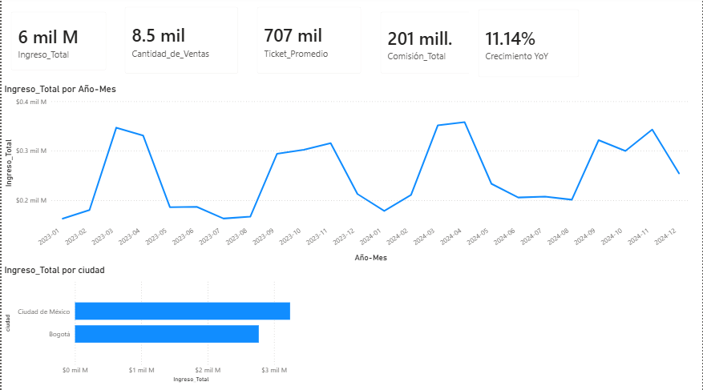

# 🏠 Andes Capital Real Estate — Análisis de Ventas Inmobiliarias

> **Nota:** los datos de este proyecto son simulados con fines de práctica.

Análisis de ventas de propiedades en Bogotá y Ciudad de México, con un modelo de datos en esquema estrella (star schema) y dashboard interactivo en Power BI. El objetivo es identificar qué segmentos, canales y zonas generan más rentabilidad para priorizar estrategia comercial.

---

## 🎯 Objetivo

Evaluar el desempeño comercial de Andes Capital Real Estate durante 2023–2024 para responder:

- ¿Qué ciudad y tipo de propiedad generan más ingresos?
- ¿Qué canal de venta (Corredor vs Directo) es más rentable considerando comisiones?
- ¿Qué segmento de cliente aporta más valor?
- ¿Cuánto del inventario e ID de clientes registrados se ha convertido en ventas reales?

---

## 📦 Fuente de datos

Modelo en esquema estrella: 1 tabla de hechos + 2 tablas de dimensión.

| Tabla | Filas | Contenido |
|---|---|---|
| `hecho_ventas_propiedades.csv` | 8,500 | Cada venta: fecha, cliente, propiedad, precio, canal, comisión |
| `dim_clientes.csv` | 3,500 | Segmento de comprador, país, ciudad |
| `dim_propiedades.csv` | 8,000 | Tipo, barrio, tamaño (m²), precio publicado, categoría |

Periodo cubierto: **enero 2023 – diciembre 2024**. Sin valores nulos en la tabla de hechos.

---

## 🗂️ Modelo de datos

Relaciones uno-a-muchos desde las dimensiones hacia la tabla de hechos:

**dim_clientes** (id_cliente) → **hecho_ventas_propiedades** ← **dim_propiedades** (id_propiedad)

Esto permite analizar cada venta tanto por características del cliente (segmento, país) como de la propiedad (tipo, barrio, tamaño).

---

## 📊 KPIs y hallazgos principales

**Generales**
- Revenue total: **$6,012.5M** en 8,500 ventas — ticket promedio de **$707,353**.
- Comisión total pagada: **$200.6M** (3.3% del revenue).
- Crecimiento YoY: **+11.1%** (de $2,847.7M en 2023 a $3,164.8M en 2024).

**Por ciudad**
| Ciudad | Ventas | Revenue | Precio/m² |
|---|---|---|---|
| Ciudad de México | 4,123 | $3,242.2M | $4,015 |
| Bogotá | 4,377 | $2,770.3M | $3,319 |

➡️ CDMX vende menos unidades pero genera más revenue y un precio por m² **21% más alto** que Bogotá.

**Por canal de venta**
| Canal | Ventas | % del total | Comisión promedio |
|---|---|---|---|
| Corredor | 6,181 | 72.7% | 4.01% |
| Directo | 2,319 | 27.3% | 1.50% |

➡️ El canal Directo cuesta **2.7x menos en comisión**, pero representa poco más de una cuarta parte de las ventas — oportunidad de fortalecerlo.

**Por segmento de cliente**
| Segmento | Ventas | Revenue |
|---|---|---|
| Primera vez | 5,302 | $3,783.6M |
| Inversionista | 2,093 | $1,471.4M |
| Alto patrimonio | 1,105 | $757.5M |

**Conversión de base de datos**

- Solo **3,139 de 3,500 clientes** registrados (89.7%) han comprado — 361 clientes sin conversión aún.
- Solo **5,223 de 8,000 propiedades** del catálogo (65.3%) se han vendido — 2,777 propiedades sin movimiento.
- **2,421 de 3,139 clientes compradores (77.1%) son recurrentes** (2+ compras), hasta un máximo de 10 compras por cliente — señal fuerte de retención en el segmento inversionista.
- El **análisis de cohortes muestra caída fuerte después del primer mes** en la mayoría de los meses de cohorte (ej. cohorte 2023-01: 224 clientes iniciales, cae a 13 en el segundo mes), aunque algunos meses mantienen actividad recurrente varios meses después — consistente con el 77% de clientes recurrentes ya identificado.

**Top 5 barrios por revenue:** Reforma, San Ángel, Del Valle, Polanco, Coyoacán (todos en CDMX).

---

## 💡 Recomendaciones

1. **Fortalecer el canal Directo**: genera casi el mismo ticket promedio que Corredor pero con comisión 2.7x menor — ideal para mejorar margen si se invierte en capacidad de venta propia.
2. **Reactivar inventario estancado**: el 34.7% de las propiedades del catálogo no se ha vendido — revisar precio o mix de zonas.
3. **Campaña dirigida a los 361 clientes sin conversión**, aprovechando que el 77% de compradores ya es recurrente (el modelo de retención funciona una vez que el cliente compra por primera vez).
4. **Profundizar en CDMX**: mayor precio por m² y revenue por venta — posible foco de expansión de inventario.

---

## 📈 Dashboard en Power BI

Tres páginas interactivas:

**Overview** — KPIs generales, ingreso mensual y comparación de revenue por ciudad.

**Análisis de Cohortes** — retención de clientes por mes de primera compra, mostrando cuántos siguen comprando en los meses siguientes.

**Análisis Comercial** — participación por tipo de propiedad, canal de venta y segmento de cliente, con tabla de detalle por tipo de propiedad.

---

## 🚀 Cómo ejecutar

1. Descarga `Andes_Capital_Real_Estate.pbix` y ábrelo con Power BI Desktop (gratuito).
2. Los 3 archivos CSV (`dim_clientes.csv`, `dim_propiedades.csv`, `hecho_ventas_propiedades.csv`) están incluidos en el repo y son la fuente de datos del modelo — no requieren descarga externa.

---

## 🛠️ Tecnologías utilizadas

Power BI · DAX · Modelado de datos (esquema estrella)

---

## 📁 Archivos del repositorio

- `Andes_Capital_Real_Estate.pbix` — dashboard interactivo
- `dim_clientes.csv`, `dim_propiedades.csv`, `hecho_ventas_propiedades.csv` — datos fuente
- `README.md`

---

**Autor:** Pablo Garza — [LinkedIn](https://www.linkedin.com/in/pablo-garza-79b2823b8)
